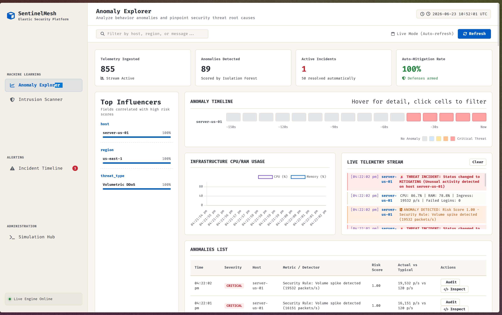
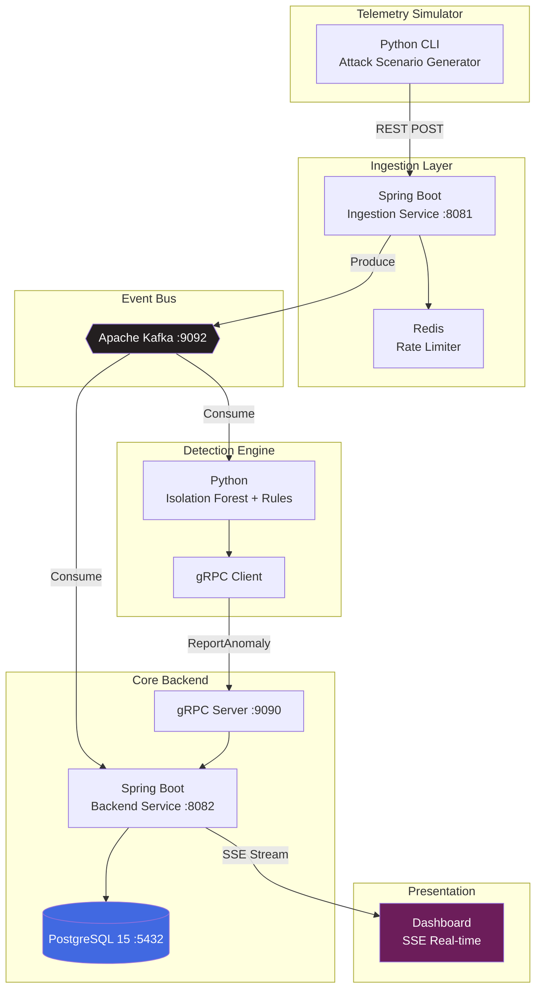
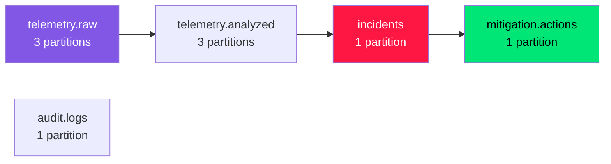
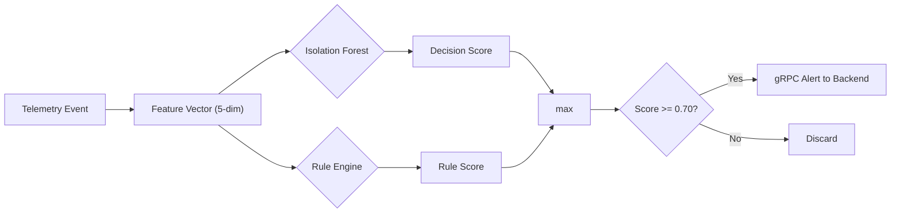
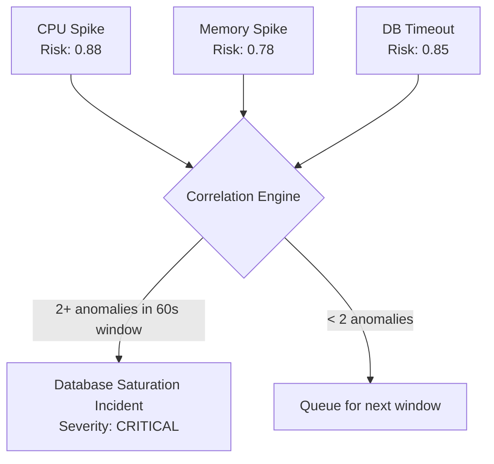
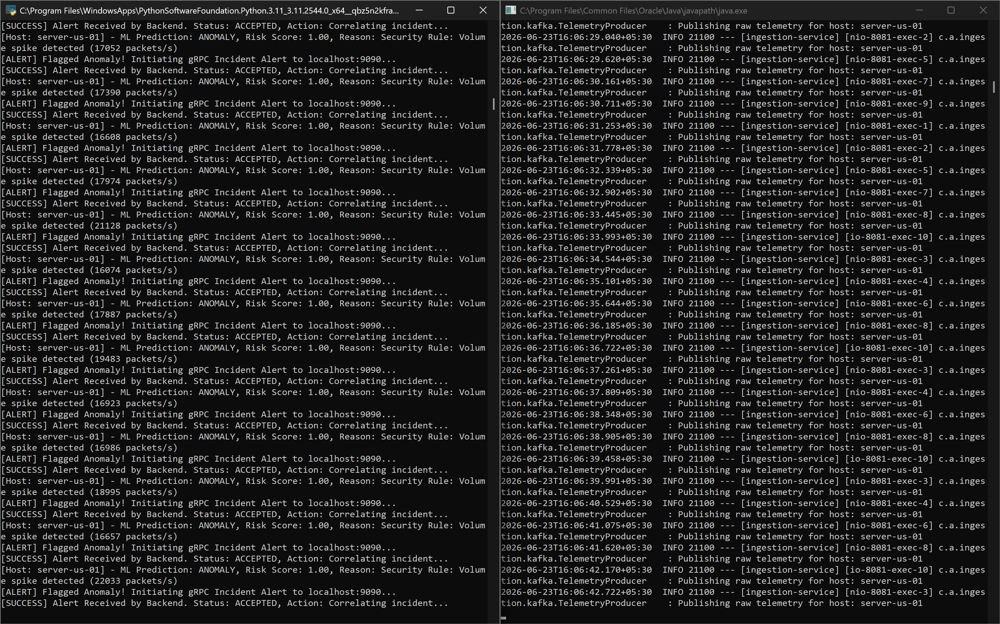

<div align="center">

# SentinelMesh Platform

### Autonomous Infrastructure Monitoring & Incident Response

[](https://openjdk.org/projects/jdk/22/)
[](https://spring.io/projects/spring-boot)
[](https://www.python.org/)
[](https://kafka.apache.org/)
[](https://grpc.io/)
[](https://www.postgresql.org/)
[](https://redis.io/)
[](https://www.docker.com/)
[](https://scikit-learn.org/)

</div>

<p align="center">
  
</p>

---

## Overview

SentinelMesh is an event-driven autonomous infrastructure monitoring platform that ingests telemetry streams, detects anomalies using unsupervised machine learning, correlates events into security incidents, and executes simulated mitigation workflows in real time.

```
Traditional Monitoring:

  Server Fails --> Engineer Gets Alert (~15 min) --> Engineer Investigates (~30 min) --> Engineer Fixes (~45 min)
  Mean Time to Resolution: 90+ minutes

SentinelMesh:

  Telemetry Stream --> AI Detection (~50 ms) --> Risk Assessment (~10 ms) --> Auto-Mitigation (~6 s) --> Incident Timeline --> Human Review
  Mean Time to Resolution: under 10 seconds
```

---

## Architecture



### Kafka Topic Topology



---

## Anomaly Detection Pipeline



### Isolation Forest Model

The core detector uses an unsupervised Isolation Forest trained on 1,000 synthetic normal telemetry samples across 5 dimensions.

$$
\text{Feature Vector: } \mathbf{x} = [\text{CPU\%}, \text{RAM\%}, \text{ResponseTime}, \text{NetworkPkts}, \text{FailedLogins}]
$$

Anomalies are isolated by building an ensemble of random binary trees:

$$
s(\mathbf{x}, n) = 2^{-\frac{\mathbb{E}[h(\mathbf{x})]}{c(n)}}
$$

Where `h(x)` is the path length from root to leaf for point `x`, and `c(n)` is the average path length of an unsuccessful search in a BST. Scores approaching 1 indicate anomalies; scores approaching 0 indicate normal observations.

**Risk score mapping:**

```python
if prediction == -1:  # anomaly flagged by ML
    risk_score = min(1.0, max(0.5, 0.5 + (-decision_score * 4)))
else:  # normal observation
    risk_score = min(0.35, max(0.0, 0.20 - decision_score))
```

### Rule-Based Expert Overlay

Deterministic security rules provide explainable alerts atop the ML model:

| Rule | Condition | Minimum Risk | Classification |
|------|-----------|-------------|----------------|
| Authentication Abuse | `failedLogins >= 20` | 0.90 | Security Rule: High auth failures |
| Volumetric DDoS | `networkPackets >= 15000` | 0.95 | Security Rule: Volume spike |
| Resource Exhaustion | `CPU >= 90% AND RAM >= 90%` | 0.88 | Resource Rule: Multi-resource saturation |
| Memory Leak | `RAM >= 92%` | 0.78 | Performance Rule: Memory leak pattern |

```python
if failed_logins >= 20:
    risk_score = max(risk_score, 0.90)
    reason = f"Security Rule: High auth failures ({failed_logins} logins)"
    rule_triggered = True
elif network_packets >= 15000:
    risk_score = max(risk_score, 0.95)
    reason = f"Security Rule: Volume spike detected ({network_packets} packets/s)"
```

---

## Incident Correlation Engine

Rather than generating one alert per anomaly, SentinelMesh buffers anomalies per host in a 60-second sliding window. When two or more anomalies accumulate, a single correlated incident is created with composite severity scoring.



```java
@Transactional
public void correlateAnomaly(Anomaly newAnomaly) {
    Incident activeIncident = incidentRepository
        .findFirstByHostAndStatusOrderByIdDesc(host, "ACTIVE")
        .orElse(null);

    if (activeIncident != null) {
        newAnomaly.setIncident(activeIncident);
        return;
    }

    List<Anomaly> unassociated = anomalyRepository
        .findByHostAndIncidentIsNullAndTimestampAfter(host, cutoff);

    if (unassociated.size() >= 2) {
        Incident incident = Incident.builder()
            .incidentUuid(UUID.randomUUID().toString())
            .severity(determineSeverity(unassociated))
            .description(classifyIncident(unassociated))
            .status("ACTIVE")
            .build();
        incidentRepository.save(incident);
        mitigationService.triggerMitigation(incident);
    }
}
```

---

## Autonomous Mitigation Engine

The mitigation engine executes simulated countermeasures based on incident classification. Actions run asynchronously via Spring's `@Async` and resolve within approximately 6 seconds.

| Incident Type | Trigger | Mitigation Action | Behavior |
|--------------|---------|-------------------|----------|
| Brute Force | `failedLogins > 50` | `MOCK_BLOCK_IP` | Simulated firewall rule blocks attacking IP |
| DDoS Attack | `networkPackets > 15000` | `MOCK_RATE_LIMIT_IP` | Simulated edge rate limiter throttles floods |
| Resource Exhaustion | `CPU > 95%` | `MOCK_SCALE_UP` | Simulated auto-scaling provisions redundant node |
| Memory Leak | Gradual RAM climb | `MOCK_RESTART_SERVICES` | Simulated graceful service restart |

```java
@Async
public CompletableFuture<Void> triggerMitigation(Incident incident) {
    incident.setStatus("MITIGATING");

    String actionType;
    if (desc.contains("brute force") || desc.contains("auth")) {
        actionType = "MOCK_BLOCK_IP";
    } else if (desc.contains("ddos") || desc.contains("network")) {
        actionType = "MOCK_RATE_LIMIT_IP";
    } else if (desc.contains("memory") || desc.contains("cpu")) {
        actionType = "MOCK_SCALE_UP";
    }

    MitigationAction action = MitigationAction.builder()
        .actionType(actionType)
        .executedAt(Instant.now())
        .result("SUCCESS")
        .build();

    mitigationActionRepository.save(action);
    incident.setStatus("RESOLVED");
    incident.setResolvedAt(Instant.now());
    sseBroadcaster.broadcast("incident", incident);
    return CompletableFuture.completedFuture(null);
}
```

---

## Communication Layer: gRPC

The AI Engine communicates with the Backend via gRPC, chosen for contract-first development, binary Protobuf serialization, and HTTP/2 multiplexing.

| Property | REST | gRPC |
|----------|------|------|
| Protocol | HTTP/1.1 + JSON | HTTP/2 + Protobuf |
| Serialization | Text | Binary |
| Contract | OpenAPI (optional) | `.proto` (mandatory) |
| Streaming | Limited | Native bidirectional |
| Throughput | Baseline | 7-10x faster |
| Code Generation | External tools | Built-in |

```protobuf
syntax = "proto3";

service AnomalyService {
  rpc ReportAnomaly (AnomalyRequest) returns (AnomalyResponse);
}

message AnomalyRequest {
  string host = 1;
  double riskScore = 2;
  string reason = 3;
  int64 eventTimestamp = 4;
  double cpu = 5;
  double memory = 6;
  double responseTime = 7;
  int32 failedLogins = 8;
  int64 networkPackets = 9;
}

message AnomalyResponse {
  string status = 1;
  string incidentId = 2;
  string mitigationAction = 3;
}
```

---

## Database Schema

```sql
CREATE TABLE telemetry_events (
    id BIGSERIAL PRIMARY KEY,
    host VARCHAR(255),
    region VARCHAR(50),
    cpu DOUBLE PRECISION,
    memory DOUBLE PRECISION,
    disk DOUBLE PRECISION,
    network_packets BIGINT,
    failed_logins INTEGER,
    request_rate BIGINT,
    response_time DOUBLE PRECISION,
    timestamp TIMESTAMP,
    received_at TIMESTAMP
);

CREATE TABLE anomalies (
    id BIGSERIAL PRIMARY KEY,
    host VARCHAR(255),
    risk_score DOUBLE PRECISION,
    reason TEXT,
    timestamp TIMESTAMP,
    cpu DOUBLE PRECISION,
    memory DOUBLE PRECISION,
    response_time DOUBLE PRECISION,
    failed_logins INTEGER,
    network_packets BIGINT,
    incident_id BIGINT REFERENCES incidents(id)
);

CREATE TABLE incidents (
    id BIGSERIAL PRIMARY KEY,
    incident_uuid VARCHAR(36) UNIQUE NOT NULL,
    host VARCHAR(255),
    severity VARCHAR(20),
    description TEXT,
    status VARCHAR(20),
    created_at TIMESTAMP,
    resolved_at TIMESTAMP
);

CREATE TABLE mitigation_actions (
    id BIGSERIAL PRIMARY KEY,
    incident_id BIGINT,
    action_type VARCHAR(50),
    executed_at TIMESTAMP,
    result VARCHAR(20),
    details TEXT
);
```

---

## Quick Start

### Prerequisites

- Java 22
- Python 3.11+
- Docker
- Maven 3.9+

### 1. Launch Infrastructure

```bash
docker run -d --name sentinelmesh-kafka \
  -p 9092:9092 \
  -e KAFKA_NODE_ID=1 \
  -e KAFKA_PROCESS_ROLES="broker,controller" \
  -e KAFKA_LISTENERS="PLAINTEXT://:9092,CONTROLLER://:9093" \
  -e KAFKA_ADVERTISED_LISTENERS="PLAINTEXT://localhost:9092" \
  -e KAFKA_CONTROLLER_QUORUM_VOTERS="1@localhost:9093" \
  -e KAFKA_LISTENER_SECURITY_PROTOCOL_MAP="CONTROLLER:PLAINTEXT,PLAINTEXT:PLAINTEXT" \
  -e KAFKA_CONTROLLER_LISTENER_NAMES="CONTROLLER" \
  apache/kafka:3.7.0

docker run -d --name sentinelmesh-postgres \
  -e POSTGRES_DB=sentinelmesh \
  -e POSTGRES_USER=postgres \
  -e POSTGRES_PASSWORD=postgres \
  -p 5432:5432 postgres:15-alpine

docker run -d --name sentinelmesh-redis \
  -p 6379:6379 redis:7-alpine
```

### 2. Build and Launch Services

```bash
# Terminal 1: Ingestion Service (port 8081)
cd sentinelmesh-ingestion
mvn clean package -DskipTests
java -jar target/ingestion-service-1.0.0.jar

# Terminal 2: Core Backend (port 8082, gRPC 9090)
cd sentinelmesh-backend
mvn clean package -DskipTests
java -jar target/backend-service-1.0.0.jar

# Terminal 3: AI Engine
cd sentinelmesh-ai
pip install -r requirements.txt
python ai_engine.py
```

### 3. Dashboard

Open `http://localhost:8082/index.html`

### 4. Simulator

```bash
cd sentinelmesh-ai
python simulator.py
```

<p align="center">
  
</p>

Available attack scenarios:

| Mode | Scenario | Target Host | Detection Trigger |
|------|----------|-------------|-------------------|
| 1 | Normal Traffic | Random | None |
| 2 | Volumetric DDoS | `server-us-01` | `networkPackets >= 15000` |
| 3 | Brute Force Auth | `server-ap-01` | `failedLogins >= 20` |
| 4 | Memory Leak | `server-eu-02` | RAM climb to 92%+ |
| 5 | CPU Exhaustion | `server-us-03` | CPU climb to 95%+ |

---

## Project Structure

```
sentinel-mesh-platform/
|
|-- sentinelmesh-ingestion/          # Spring Boot Ingestion Service (port 8081)
|   |-- pom.xml
|   |-- src/main/java/com/aetherflow/ingestion/
|       |-- controller/TelemetryController.java      # REST API endpoint
|       |-- kafka/TelemetryProducer.java             # Kafka publisher
|       |-- service/RateLimiterService.java          # Redis-based rate limiter
|       |-- model/TelemetryData.java                 # Validated DTO
|       |-- config/KafkaConfig.java                 # Topic + producer beans
|       |-- IngestionApplication.java               # Spring Boot entry point
|   |-- src/main/resources/application.yml
|
|-- sentinelmesh-backend/            # Spring Boot Core Backend (port 8082, gRPC 9090)
|   |-- pom.xml
|   |-- src/main/proto/telemetry.proto               # gRPC contract definition
|   |-- src/main/java/com/aetherflow/backend/
|       |-- grpc/AnomalyGrpcService.java             # gRPC server implementation
|       |-- grpc/GrpcServerRunner.java               # gRPC server lifecycle
|       |-- kafka/TelemetryConsumer.java             # Kafka consumer + JPA persistence
|       |-- service/IncidentCorrelationService.java  # Sliding-window correlation
|       |-- service/MitigationService.java           # Async auto-remediation
|       |-- service/SseBroadcaster.java             # Server-Sent Events broadcast
|       |-- controller/MetricController.java        # REST metrics API
|       |-- controller/SseController.java           # SSE stream endpoint
|       |-- model/TelemetryEvent.java               # JPA entity
|       |-- model/Anomaly.java                       # JPA entity
|       |-- model/Incident.java                      # JPA entity
|       |-- model/MitigationAction.java              # JPA entity
|       |-- repository/*.java                        # Spring Data JPA repositories
|       |-- BackendApplication.java                 # Spring Boot entry point
|   |-- src/main/resources/application.yml
|   |-- src/main/resources/static/
|       |-- index.html                               # Dashboard SPA
|       |-- app.js                                   # SSE client + Chart.js logic
|       |-- styles.css                               # Dark theme stylesheet
|
|-- sentinelmesh-ai/                 # Python AI Engine + Simulator
|   |-- ai_engine.py                                # Kafka consumer + ML + gRPC client
|   |-- simulator.py                                # Interactive attack scenario CLI
|   |-- train_model.py                              # Isolation Forest training script
|   |-- isolation_forest.pkl                        # Serialized ML model
|   |-- telemetry_pb2.py                            # Generated Protobuf stubs
|   |-- telemetry_pb2_grpc.py                        # Generated gRPC stubs
|   |-- requirements.txt
|
|-- docker-compose.yml               # Infrastructure orchestration
|-- .gitignore
```

---

## Technology Stack

| Layer | Technology | Purpose |
|-------|-----------|---------|
| Event Streaming | Apache Kafka 3.7 | Durable partitioned message bus |
| Ingestion API | Spring Boot 3.3 + Jakarta Validation | REST telemetry endpoint with rate limiting |
| Rate Limiting | Redis 7 | Per-host request throttling, fail-open |
| Persistence | PostgreSQL 15 + Spring Data JPA | Telemetry, anomalies, incidents, mitigations |
| Anomaly Detection | scikit-learn IsolationForest | Unsupervised ML on 5 feature dimensions |
| Explainable Rules | Python Rule Engine | Deterministic security pattern matching |
| Service Communication | gRPC 1.60 + Protobuf | Binary serialization, contract-first |
| Real-time Streaming | Server-Sent Events + Chart.js | Dashboard live updates, zero polling |
| Containerization | Docker | Infrastructure services |

---

## Test Results

| Metric | Value |
|--------|-------|
| Telemetry Events Processed | 350+ |
| Anomalies Detected | 50+ |
| Incidents Correlated | 13 |
| Mitigation Actions Executed | 9+ |
| Monitored Hosts | 12 across 3 regions |
| Concurrent SSE Clients | 2 |
| End-to-End Resolution Latency | under 10 seconds |

---

<div align="center">

### Built by [Benedict Chacko Mathew](https://github.com/The-Peacemaker)

</div>
