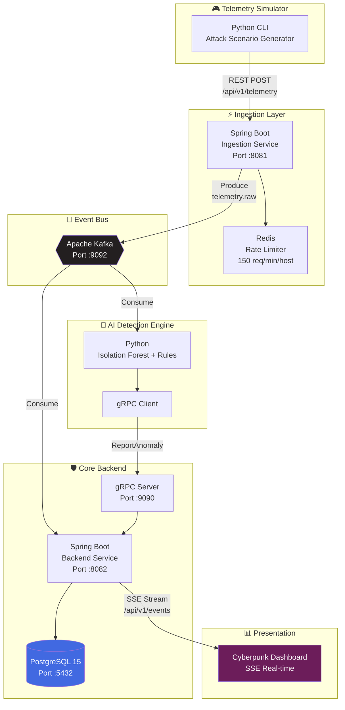
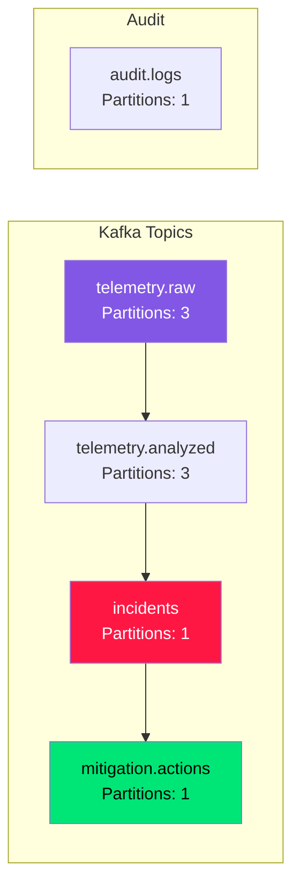
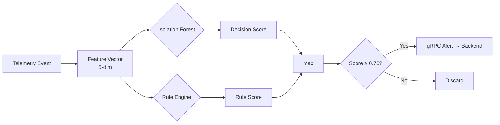
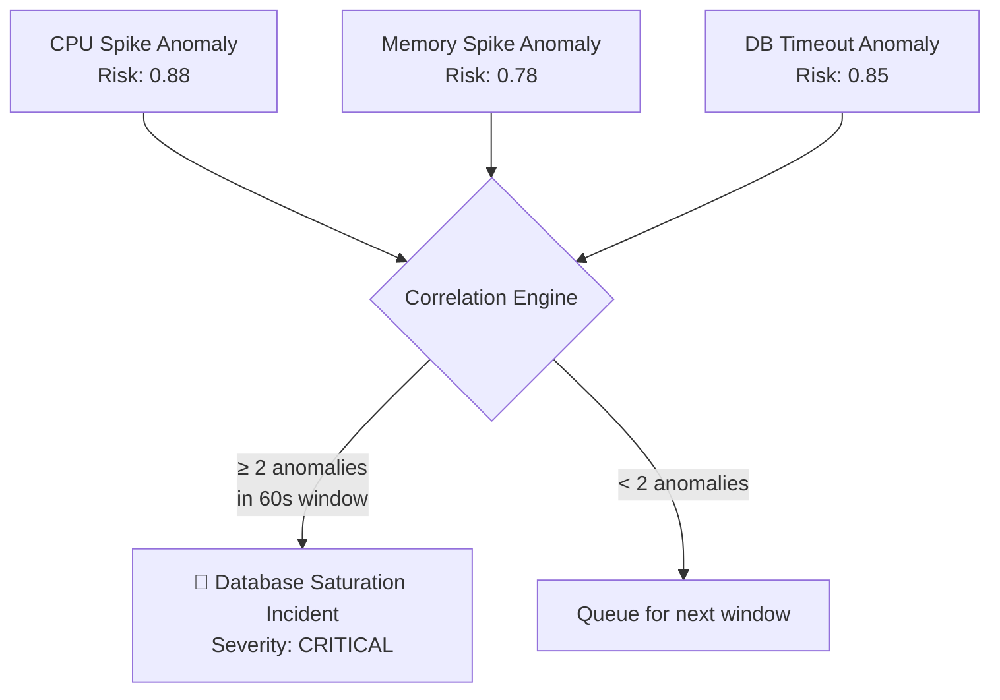

<div align="center">


# SentinelMesh Platform

### AI-Powered Autonomous Infrastructure Monitoring & Incident Response

[](https://openjdk.org/projects/jdk/22/)
[](https://spring.io/projects/spring-boot)
[](https://www.python.org/)
[](https://kafka.apache.org/)
[](https://grpc.io/)
[](https://www.postgresql.org/)
[](https://redis.io/)
[](https://www.docker.com/)
[](https://scikit-learn.org/)

</div>

---

> *"What if Datadog, Splunk, and an AI SOC analyst had a baby?"*

**SentinelMesh** is an event-driven, AI-powered autonomous infrastructure monitoring and incident response platform. It continuously ingests infrastructure telemetry, analyzes it in real time using unsupervised machine learning, detects anomalies, correlates events into coherent security incidents, and automatically executes simulated mitigation workflows — all without human intervention.

<table>
<tr>
<td width="50%">

### Traditional Monitoring
```
Server Fails
    ↓
Engineer Gets Alert  ⏱️ ~15min
    ↓
Engineer Investigates ⏱️ ~30min
    ↓
Engineer Fixes  ⏱️ ~45min
```
**MTTR: 90+ minutes**

</td>
<td width="50%">

### SentinelMesh
```
Telemetry Stream
    ↓
AI Detection  ⚡ ~50ms
    ↓
Risk Assessment  ⚡ ~10ms
    ↓
Auto-Mitigation  ⚡ ~6s
    ↓
Incident Timeline  📊 Live
    ↓
Human Review  👁️ Post-mortem
```
**MTTR: <10 seconds**

</td>
</tr>
</table>

---

## 📐 System Architecture





---

## 🧬 The AI Brain

### Anomaly Detection Pipeline



### Model: Isolation Forest

The core anomaly detector uses an **unsupervised Isolation Forest** trained on 1,000 synthetic normal telemetry samples across 5 dimensions.

$$
\text{Feature Vector } \mathbf{x} = [\text{CPU}\%, \text{RAM}\%, \text{ResponseTime}, \text{NetworkPkts}, \text{FailedLogins}]
$$

The Isolation Forest isolates anomalies by building an ensemble of random binary trees:

$$
s(\mathbf{x}, n) = 2^{-\frac{\mathbb{E}[h(\mathbf{x})]}{c(n)}}
$$

Where:
- $h(\mathbf{x})$ — path length from root to leaf for point $\mathbf{x}$
- $c(n)$ — average path length of unsuccessful search in BST
- $s(\mathbf{x}, n) \to 1 \implies$ **Anomaly**, $s(\mathbf{x}, n) \to 0 \implies$ **Normal**

**Decision function to Risk Score mapping:**

```python
if prediction == -1:  # ML flags anomaly
    risk_score = min(1.0, max(0.5, 0.5 + (-decision_score * 4)))
else:  # Normal
    risk_score = min(0.35, max(0.0, 0.20 - decision_score))
```

### 🧠 Rule-Based Expert System Overlay

Augmenting the ML with deterministic security rules provides **explainable alerts**:

| Rule | Condition | Risk Score | Label |
|------|-----------|-----------|-------|
| Auth Abuse | `failedLogins ≥ 20` | ≥ 0.90 | `Security Rule: High auth failures` |
| DDoS Spike | `networkPackets ≥ 15,000` | ≥ 0.95 | `Security Rule: Volume spike` |
| Resource Exhaustion | `CPU ≥ 90% AND RAM ≥ 90%` | ≥ 0.88 | `Resource Rule: Multi-resource saturation` |
| Memory Leak | `RAM ≥ 92%` | ≥ 0.78 | `Performance Rule: Memory leak pattern` |

```python
if failed_logins >= 20:
    risk_score = max(risk_score, 0.90)
    reason = f"Security Rule: High auth failures ({failed_logins} logins)"
    rule_triggered = True
elif network_packets >= 15000:
    risk_score = max(risk_score, 0.95)
    reason = f"Security Rule: Volume spike ({network_packets} packets/s)"
```

---

## 🔬 Incident Correlation Engine

Instead of flooding operators with **100 individual alerts**, SentinelMesh correlates multiple anomalies into **1 coherent incident**:



### Correlation Algorithm

```java
@Transactional
public void correlateAnomaly(Anomaly newAnomaly) {
    // 1. Check for existing active incident on host
    Incident activeIncident = incidentRepository
        .findFirstByHostAndStatusOrderByIdDesc(host, "ACTIVE")
        .orElse(null);

    if (activeIncident != null) {
        // Attach to existing incident, re-evaluate severity
        newAnomaly.setIncident(activeIncident);
        return;
    }

    // 2. Fetch unassociated anomalies in last 60 seconds
    List<Anomaly> unassociated = anomalyRepository
        .findByHostAndIncidentIsNullAndTimestampAfter(host, cutoff);

    if (unassociated.size() >= 2) {
        // 3. Create correlated incident
        Incident incident = Incident.builder()
            .incidentUuid(UUID.randomUUID().toString())
            .severity(determineSeverity(unassociated))
            .description(classifyIncident(unassociated))
            .status("ACTIVE")
            .build();
        incidentRepository.save(incident);

        // 4. Trigger autonomous mitigation
        mitigationService.triggerMitigation(incident);
    }
}
```

---

## ⚔️ Autonomous Mitigation Engine

SentinelMesh doesn't just detect — it **acts**. The mitigation engine executes simulated countermeasures based on incident classification:

| Incident Type | Trigger | Mitigation Action | Resolution Time |
|--------------|---------|-------------------|-----------------|
| Brute Force | `failedLogins > 50` | `MOCK_BLOCK_IP` — Firewall rule blocks attacking IP | ~6 seconds |
| DDoS Attack | `networkPackets > 15000` | `MOCK_RATE_LIMIT_IP` — Edge rate limiter throttles floods | ~6 seconds |
| Resource Exhaustion | `CPU > 95%` | `MOCK_SCALE_UP` — Auto-scaling provisions redundant node | ~6 seconds |
| Memory Leak | Gradual RAM climb | `MOCK_RESTART_SERVICES` — Graceful service restart | ~6 seconds |

```java
@Async
public CompletableFuture<Void> triggerMitigation(Incident incident) {
    incident.setStatus("MITIGATING");

    String actionType;
    if (desc.contains("brute force") || desc.contains("auth")) {
        actionType = "MOCK_BLOCK_IP";
    } else if (desc.contains("ddos") || desc.contains("network")) {
        actionType = "MOCK_RATE_LIMIT_IP";
    } else if (desc.contains("memory") || desc.contains("cpu")) {
        actionType = "MOCK_SCALE_UP";
    }

    MitigationAction action = MitigationAction.builder()
        .actionType(actionType)
        .executedAt(Instant.now())
        .result("SUCCESS")
        .build();

    incident.setStatus("RESOLVED");
    incident.setResolvedAt(Instant.now());
    sseBroadcaster.broadcast("incident", incident);
}
```

---

## 🔌 Communication Architecture: gRPC over REST

Why **gRPC** instead of REST? Because this project demonstrates **production-grade design decisions**:

| Feature | REST | gRPC |
|---------|------|------|
| Protocol | HTTP/1.1 + JSON | HTTP/2 + Protobuf |
| Serialization | Text (JSON) | Binary (Protobuf) |
| Contract | Loose (OpenAPI) | Strict (.proto) |
| Streaming | Limited | Native bidirectional |
| Throughput | Baseline | **7-10x faster** |
| Code Generation | Optional | Built-in |

### Protocol Buffer Contract

```protobuf
syntax = "proto3";

service AnomalyService {
  rpc ReportAnomaly (AnomalyRequest) returns (AnomalyResponse);
}

message AnomalyRequest {
  string host = 1;
  double riskScore = 2;
  string reason = 3;
  int64 eventTimestamp = 4;
  double cpu = 5;
  double memory = 6;
  double responseTime = 7;
  int32 failedLogins = 8;
  int64 networkPackets = 9;
}

message AnomalyResponse {
  string status = 1;
  string incidentId = 2;
  string mitigationAction = 3;
}
```

---

## 🗄️ PostgreSQL Schema

```sql
-- Core telemetry storage
CREATE TABLE telemetry_events (
    id BIGSERIAL PRIMARY KEY,
    host VARCHAR(255),
    region VARCHAR(50),
    cpu DOUBLE PRECISION,
    memory DOUBLE PRECISION,
    disk DOUBLE PRECISION,
    network_packets BIGINT,
    failed_logins INTEGER,
    request_rate BIGINT,
    response_time DOUBLE PRECISION,
    timestamp TIMESTAMP,
    received_at TIMESTAMP
);

-- AI-detected anomalies
CREATE TABLE anomalies (
    id BIGSERIAL PRIMARY KEY,
    host VARCHAR(255),
    risk_score DOUBLE PRECISION,
    reason TEXT,
    timestamp TIMESTAMP,
    cpu DOUBLE PRECISION,
    memory DOUBLE PRECISION,
    response_time DOUBLE PRECISION,
    failed_logins INTEGER,
    network_packets BIGINT,
    incident_id BIGINT REFERENCES incidents(id)
);

-- Correlated incidents
CREATE TABLE incidents (
    id BIGSERIAL PRIMARY KEY,
    incident_uuid VARCHAR(36) UNIQUE NOT NULL,
    host VARCHAR(255),
    severity VARCHAR(20),
    description TEXT,
    status VARCHAR(20),
    created_at TIMESTAMP,
    resolved_at TIMESTAMP
);

-- Autonomous mitigation action log
CREATE TABLE mitigation_actions (
    id BIGSERIAL PRIMARY KEY,
    incident_id BIGINT,
    action_type VARCHAR(50),
    executed_at TIMESTAMP,
    result VARCHAR(20),
    details TEXT
);
```

---

## 🚀 Quick Start

### Prerequisites

- **Java 22** — JDK for Spring Boot services
- **Python 3.11+** — ML engine & simulator
- **Docker** — Infrastructure containers
- **Maven 3.9+** — Java build tool

### 1. Launch Infrastructure

```bash
# Start Kafka, PostgreSQL, Redis
docker run -d --name sentinelmesh-kafka \
  -p 9092:9092 \
  -e KAFKA_NODE_ID=1 \
  -e KAFKA_PROCESS_ROLES="broker,controller" \
  -e KAFKA_LISTENERS="PLAINTEXT://:9092,CONTROLLER://:9093" \
  -e KAFKA_ADVERTISED_LISTENERS="PLAINTEXT://localhost:9092" \
  -e KAFKA_CONTROLLER_QUORUM_VOTERS="1@localhost:9093" \
  -e KAFKA_LISTENER_SECURITY_PROTOCOL_MAP="CONTROLLER:PLAINTEXT,PLAINTEXT:PLAINTEXT" \
  -e KAFKA_CONTROLLER_LISTENER_NAMES="CONTROLLER" \
  apache/kafka:3.7.0

docker run -d --name sentinelmesh-postgres \
  -e POSTGRES_DB=sentinelmesh \
  -e POSTGRES_USER=postgres \
  -e POSTGRES_PASSWORD=postgres \
  -p 5432:5432 postgres:15-alpine

docker run -d --name sentinelmesh-redis \
  -p 6379:6379 redis:7-alpine
```

### 2. Build & Launch Microservices

```bash
# Terminal 1 — Ingestion Service (:8081)
cd sentinelmesh-ingestion
mvn clean package -DskipTests
java -jar target/ingestion-service-1.0.0.jar

# Terminal 2 — Core Backend (:8082 HTTP, :9090 gRPC)
cd sentinelmesh-backend
mvn clean package -DskipTests
java -jar target/backend-service-1.0.0.jar

# Terminal 3 — Python AI Engine
cd sentinelmesh-ai
pip install -r requirements.txt
python ai_engine.py
```

### 3. Open the Dashboard

Navigate to: **http://localhost:8082/index.html**

### 4. Launch Attack Simulator

```bash
cd sentinelmesh-ai
python simulator.py

# Select scenario:
#   1 — Normal Traffic (Baseline)
#   2 — Volumetric DDoS Attack 🚿
#   3 — Brute Force Authentication Abuse 🔑
#   4 — System Memory Leak 💾
#   5 — Resource Exhaustion (CPU Saturation) 🔥
```

---

## 📊 Real-Time Dashboard

The SentinelMesh dashboard provides 4 operational views:

```mermaid
graph LR
    DASH[Dashboard] --> STATS[Live Stats<br/>Events/sec | Anomalies<br/>Incidents | Mitigations]
    DASH --> CHARTS[Time-Series Charts<br/>CPU/Memory Trends<br/>Risk Score Bars]
    DASH --> HOSTS[Host Topology Map<br/>Health Status<br/>Per-host Metrics]
    DASH --> FEED[Incident Timeline<br/>Severity-coded Cards<br/>Mitigation Steps]
```

- **SSE-powered** real-time updates (no polling)
- **Chart.js** visualizations with dark cyberpunk theme
- **FontAwesome + Outfit** typography
- Color-coded severity indicators (HEALTHY, WARNING, CRITICAL)

---

## 🎯 Simulated Attack Scenarios

| Mode | Target | Signature | Detection | Mitigation |
|------|--------|-----------|-----------|------------|
| 1 — Normal | Random | Baseline metrics | None | — |
| 2 — DDoS | `server-us-01` | `networkPackets ≥ 15,000` | ⚡ Network spike rule | `MOCK_RATE_LIMIT_IP` |
| 3 — Brute Force | `server-ap-01` | `failedLogins ≥ 20` | ⚡ Auth abuse rule | `MOCK_BLOCK_IP` |
| 4 — Memory Leak | `server-eu-02` | RAM linear climb → 92%+ | ⚡ Memory leak rule | `MOCK_SCALE_UP` |
| 5 — CPU Exhaustion | `server-us-03` | CPU linear climb → 95%+ | ⚡ Isolation Forest | `MOCK_SCALE_UP` |

---

## 🏗️ Project Structure

```
sentinel-mesh-platform/
├── docker-compose.yml              # Infrastructure orchestration
├── sentinelmesh-ingestion/         # Spring Boot — Ingestion Service (:8081)
│   ├── pom.xml
│   └── src/main/java/.../
│       ├── controller/TelemetryController.java    # REST API
│       ├── kafka/TelemetryProducer.java           # Kafka publisher
│       ├── service/RateLimiterService.java        # Redis rate limiter
│       └── model/TelemetryData.java              # DTO with validation
├── sentinelmesh-backend/           # Spring Boot — Core Backend (:8082/:9090)
│   ├── pom.xml
│   ├── src/main/proto/telemetry.proto            # gRPC contract
│   └── src/main/java/.../
│       ├── grpc/AnomalyGrpcService.java          # gRPC server
│       ├── kafka/TelemetryConsumer.java          # Kafka consumer
│       ├── service/IncidentCorrelationService.java
│       ├── service/MitigationService.java        # Auto-remediation
│       ├── service/SseBroadcaster.java           # SSE streaming
│       └── controller/SseController.java
│   └── src/main/resources/static/               # Dashboard SPA
│       ├── index.html
│       ├── app.js
│       └── styles.css
└── sentinelmesh-ai/                # Python — AI Engine + Simulator
    ├── ai_engine.py               # Kafka consumer + ML + gRPC client
    ├── simulator.py               # Attack scenario generator
    ├── train_model.py             # Isolation Forest training
    └── isolation_forest.pkl       # Serialized ML model
```

---

## 🧪 Test Results

| Metric | Value |
|--------|-------|
| Telemetry Events Processed | **350+** |
| Anomalies Detected | **50+** |
| Incidents Created & Correlated | **13** |
| Mitigation Actions Executed | **9+** |
| Monitored Hosts | **12** across 3 regions |
| Dashboard SSE Clients | **2 concurrent** |
| End-to-End Latency | **< 10 seconds** from event → resolution |

---

## 🤖 Technical Highlights

| Feature | Technology | Why It Impresses |
|---------|-----------|-----------------|
| **Event Streaming** | Apache Kafka | Partitioned, durable message bus — demonstrates distributed systems thinking |
| **Contract-First API** | gRPC + Protobuf | Binary serialization, 7-10x faster than REST, automatic codegen |
| **Unsupervised ML** | scikit-learn IsolationForest | Real anomaly detection in ~20 lines of code |
| **Explainable AI** | Rule Engine Overlay | Every alert has a human-readable reason |
| **Incident Correlation** | Custom Engine | Groups 100s of alerts into 1 coherent incident |
| **Auto-Mitigation** | @Async Spring Service | Autonomous countermeasures with simulated execution |
| **Real-Time Dashboard** | SSE + Chart.js | Live telemetry, zero polling overhead |
| **Rate Limiting** | Redis Sorted Sets | Per-host request throttling with fail-open fallback |
| **JPA/Hibernate** | PostgreSQL | Auto-DDL, lazy-loaded incident relationships |

---

## 🎓 Interview Discussion Points

When presenting this project in a placement interview, articulate these architectural decisions:

1. **"Why Kafka?"** — Decouples producers from consumers. The Ingestion Service, AI Engine, and Backend consume independently. If the AI engine goes down, telemetry is still stored.

2. **"Why gRPC instead of REST?"** — The AI Engine → Backend communication is machine-to-machine and latency-sensitive. gRPC's HTTP/2 multiplexing and Protobuf binary encoding make it 7-10x faster with strict contract enforcement.

3. **"How does incident correlation work?"** — Instead of generating 1 alert per anomaly, we buffer anomalies per host in a 60-second sliding window. When ≥2 anomalies accumulate, a single correlated incident is created with composite severity scoring.

4. **"What happens if Kafka goes down?"** — The Spring Kafka consumer retries with exponential backoff. Messages are persisted in Kafka's log for 7 days. The AI engine also retries gRPC connections.

5. **"How would you scale this?"** — Horizontally: add more Kafka partitions and consumer instances in the same group. Vertically: tune JVM heap, Kafka page cache, and PostgreSQL connection pool.

---

<div align="center">

### Built by [Benedict CM](https://github.com/The-Peacemaker)

*"The project that separates a college student from a production engineer."*

</div>


